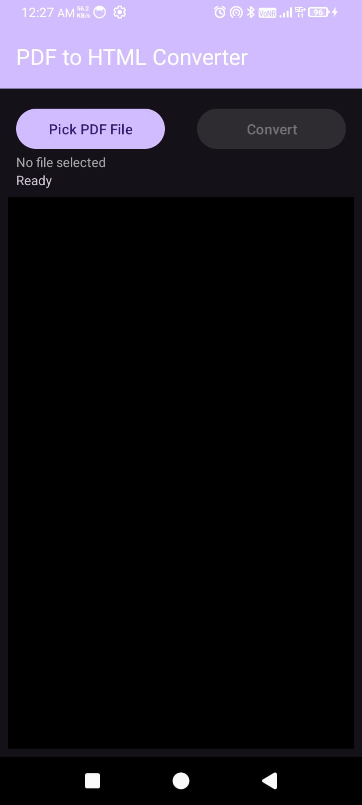
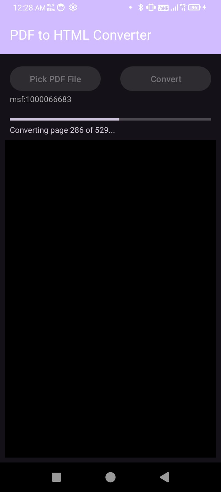
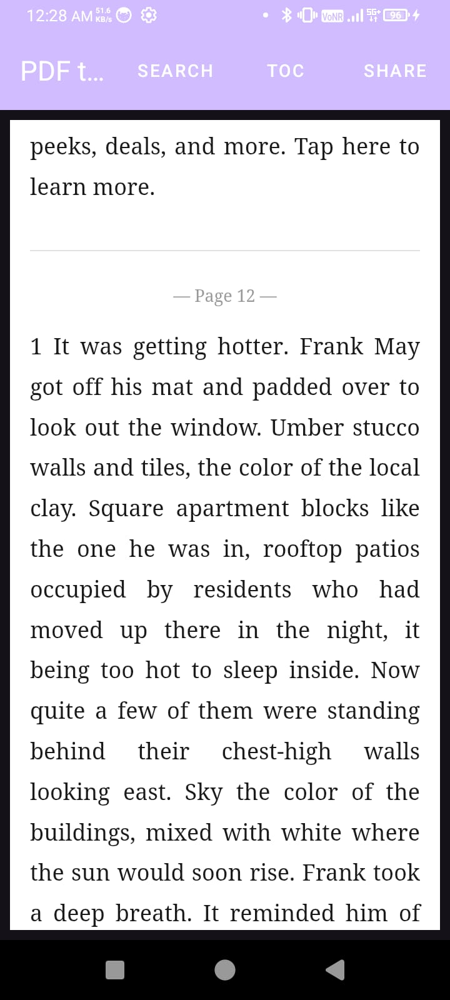
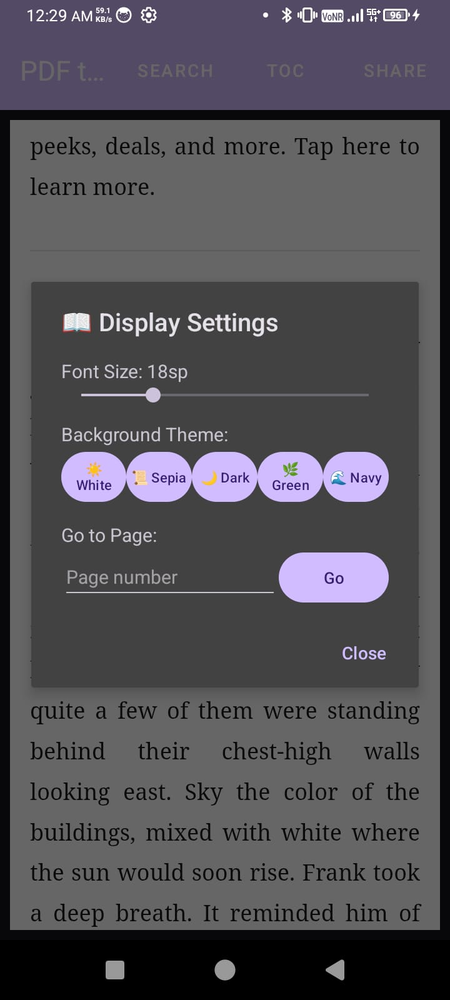

# 📖 PDF to HTML Converter

> *Because books deserve to be read comfortably — not squinted at.*

---

## 💡 Why I Built This

I love reading books. But most books available online come as PDFs — and reading a PDF on a phone is painful. You either zoom in and scroll sideways on every line, or zoom out and strain your eyes reading tiny text.

What I really wanted was **text reflow** — where the text automatically wraps to fit your screen width, just like a proper ebook. No more horizontal scrolling. No more pinching and zooming every few seconds.

So I built this app. It converts PDF books into clean HTML pages that reflow naturally on any screen size. Just pick your PDF, convert it, and read comfortably.

---

## 📱 Screenshots

  
  
  
  

---

## 🎬 Demo Video

https://github.com/Ishaan-Shaikh/PDFtoHTML/blob/main/screenshots/demo.mp4

---

## ✨ Features

- 📄 Pick any PDF book from your phone
- ⚙️ Converts PDF text to clean HTML with proper text reflow
- 📖 Comfortable full screen reading experience
- 🎨 5 reading themes — White, Sepia, Dark, Green, Navy
- 🔤 Adjustable font size
- 📑 Auto-detected Table of Contents with navigation
- 🔍 Search any word in the book with highlights
- 📌 Go to any page number instantly
- 🔖 Remembers last read position per book
- 📤 Share generated HTML file

---

## 📥 Download & Install

1. Go to the [Releases](https://github.com/Ishaan-Shaikh/PDFtoHTML/releases) page
2. Download the latest `app-debug.apk`
3. On your Android phone go to **Settings → Install Unknown Apps** and allow your file manager
4. Tap the downloaded APK to install

> Minimum Android version: **Android 8.0 (API 26)**

---

## 🛠️ Built With

- [Kotlin](https://kotlinlang.org/)
- [PDFBox Android](https://github.com/TomRoush/PdfBox-Android)
- [Android WebView](https://developer.android.com/reference/android/webkit/WebView)
- [Material Design Components](https://material.io/)

---

## 📜 License

This project is licensed under the **GNU General Public License v3.0**.

This means:
- ✅ Anyone can freely download, use and modify this app
- ❌ Nobody can make this app proprietary or sell it as a paid app
- ✅ Any modified version must also be open source under the same license

See the [LICENSE](LICENSE) file for full details.

---

## 🤝 Contributing

Pull requests are welcome! If you find a bug or want to suggest a feature, please open an issue.

---

*Made with ❤️ for book lovers everywhere*
